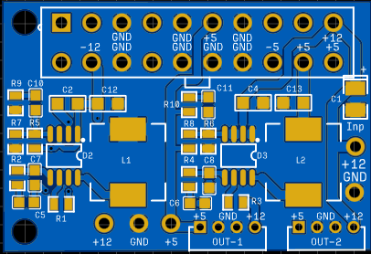
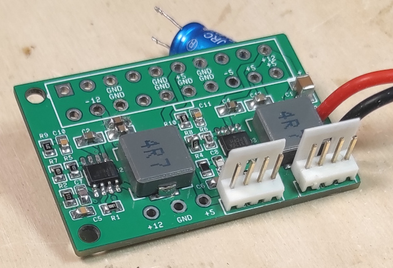

ATXMod2 для Sprinter-а
=====================

Модуль питается от +12В и вырабатывает напряжения +5В, -12В и опционально -5В.

Предназначен для установки на место разъема ATX, или на ответную часть разъема, для питания любительского персонального компьютера [Sprinter](https://sprinter.ru/).

Модуль можно использовать и в других аналогичных конструкциях, например, для питания новодельных копьютеров Орион-ПРО и Радио-86РК, с разъемами ATX.

Ток по каналу +12В  определяется используемым источником питания, рекомендуется использовать источник с током до 3,4А (мощностью 25..50Вт). Ток по каналу -12В, до 0.5А, по каналу 5В до 3А.

Выходной ток по -5V ограничивается используемым регулятором и его площадью охлаждения, около 280мА.
При использовании в компьютере Sprinter, стабилизатор D1 устанавливать не нужно, если все необходимое уже установлено на плате самого Sprinter-а.

[Исходники](Sources)

[Готовые схемы](Export)

[Герберы](Gerber)

В настоящий момент, платы модуля v1.0.0 получены, изготовлены тестовые образцы. Испытаны.

По результатам испытаний, выполнены небольшие даработки, которые должны улучшить работу модуля.
Текущая версия v1.0.1, пока не тестировалась, заказаны платы.
